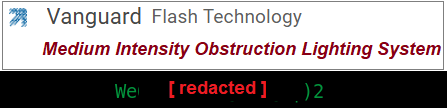

# trophies
 
Collection of vulnerabilities I've discovered and original exploits.  Many of these are the result of private research and Red Team engagements and are not released to the public.

  
**Password Hash Disclosure** 
https://nvd.nist.gov/vuln/detail/CVE-2018-9334 
https://security.paloaltonetworks.com/CVE-2018-9334 

**GlobalProtect User Stored Password Decryption** 
https://github.com/billchaison/ClobberProtect

**GlobalProtect client VPN tunnel crash** 

  
**Release 10.4.000000, Security Fix, PuTTY Log Password Disclosure** 
https://thycotic.force.com/support/s/article/SS-Release-Notes

  
**Xerox Cloning File Password Decryption** 
https://github.com/billchaison/zer0cks

  
**Allworx Admin Password Reset** 
https://github.com/billchaison/Alldorx

  
**WinSCP Stored Password Decryption** 
https://github.com/billchaison/WinSCoPe

  
**Polycom RealPresence Desktop Password Decryption** 
https://github.com/billchaison/reelpresence

  
**LogRhythm INI File Password Decryption** 
https://github.com/billchaison/GotNoRhythm

  
**VyOS Root Privilege Escalation** 
https://github.com/billchaison/VyOS-Get-Root

  
**Ericsson Password Decoder** 
https://github.com/billchaison/ED

  
**Key Systems Admin Privilege Escalation** 
https://github.com/billchaison/KeyStoned

  
**Incognito BCC Username Disclosure and Privilege Escalation** 
https://github.com/billchaison/Incog-Neato

  
**Trimble NetRS diagnostic easter egg, config file access, root privilege escalation (LFI, command injection), and back door binary** 
https://github.com/billchaison/Tremble

  
**Digi Wireless Router Password Decoder** 
https://github.com/billchaison/Dig-it

  
**Motorola NC1500 Backdoor Password** 
https://github.com/billchaison/nc1500

  
**Nokia hash2 Password Decrypter** 
https://github.com/billchaison/Nuke-ia

  
**ForeScout SecureConnector Protected Uninstaller Bypass** 

  
**VMWare Horizon LSASS Dumping** 

  
**Emerging Technologies Bandwidth Manager, unauthenticated credential disclosure, XSS** 

  
**Vanguard Flash Technology, backdoor Web Admin password** 
CVE-2025-43719

  
**Ubiquiti EdgeSwitch User Password Decrypter** 
https://github.com/billchaison/EdgeSnitch

